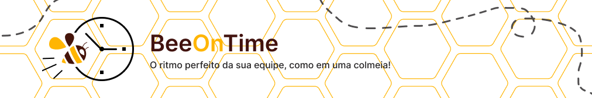
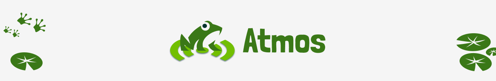

# Portfólio - Karen Gonçalves

<h2>Sumário</h2>

:small_blue_diamond: <a href="#sobre-mim">Sobre mim</a>

:small_blue_diamond: <a href="#meus-projetos">Meus Projetos</a>
<ul>
  <li><a href="#smart-farm">1ºSEM: SmartFarm</a></li>
  <li><a href="#cloud-stock">2ºSEM: CloudStock</a></li>
  <li><a href="#bot">3ºSEM: BeeOnTime</a></li>
  <li><a href="#atmos">4ºSEM: Atmos</a></li>
</ul>

<h2 id="sobre-mim">Sobre Mim</h2>

Atualmente estou cursando o 4º semestre de Desenvolvimento de Software Multiplataforma oferecido pela Faculdade de Tecnologia de São José dos Campos (FATEC). Além disso, sou técnica em Desenvolvimento de Sistemas pela ETEC Profª Ilza Nascimento Pintus.

Atuo como desenvolvedora de software na Autaza, uma empresa especializada em soluções de visão computacional e inteligência artificial aplicadas à indústria. Nessa função, colaboro em projetos que envolvem desde o desenvolvimento de aplicações full-stack até a integração com modelos de IA para inspeção automatizada de qualidade.

 Saiba mais sobre mim <a href="https://github.com/karengoncalves8/PortfolioGAP/tree/main/AboutMe/AboutMe.md">aqui!</a> 

 
   
     

<h2 id="meus-projetos">Meus Projetos</h2>
  <ul>
    <li><h3 id="smart-farm"> SmartFarm • 1º Semestre • 2024/01 </h3>
       
      

        <a href="https://github.com/SkyFlyTeam/SmartFarm" target="_blank">Repositório do Projeto</a> • Equipe SkyFly
      

      <b>📑 Descrição do Problema </b>
      
 A equipe I9, do curso de Manufatura Avançada da FATEC, identificou que o processo de coleta e análise de dados ambientais em estufas inteligentes, feito manualmente via Excel, é lento, propenso a erros e exige muito da equipe técnica. Essa limitação dificulta o acompanhamento eficiente do cultivo de plantas e hortaliças, impactando diretamente na produtividade e no controle ambiental. 
      

       
      <b>🎯 Objetivo</b>
      
 Desenvolver um painel de visualização capaz de monitorar em tempo real as condições da estufa por meio de gráficos interativos e automatizar tanto a coleta quanto o armazenamento de dados ambientais. O foco é melhorar a eficiência, reduzir o esforço manual e garantir mais precisão no monitoramento.
      

       
      <b>💡 Solução  </b>
      
 Foi criado um site com interface amigável e intuitiva, que realiza comunicação direta com a placa utilizada, de forma que os dados capturados pela estufa são apresentados de forma visual e clara em tempo real. A plataforma permite acompanhar as variáveis ambientais da estufa por meio de gráficos, facilitando a tomada de decisões. 
      

       
      <b> 🛠️ Tecnologias Utilizadas </b>
      
 

      

       
      <b>🙋‍♀️ Contribuições pessoais  </b>
      
 Atuei como desenvolvedora da equipe SkyFly, ajudando na elaboração do protótipo inicial da aplicação e sendo responsável pelo desenvolvimento do frontend. Colaborei ativamente com meus colegas de equipe, oferecendo suporte técnico, especialmente nas etapas que envolviam HTML e CSS, visto que muitos estavam tendo o primeiro contato com essas tecnologias. Minha experiência prévia foi fundamental para orientar o time e garantir um desenvolvimento mais fluido e colaborativo. Também desenvolvi algumas funcionalidades no backend, como rotas para retornar com os dados a serem exibidos nos gráficos. 
      

      

        <b> Habilidades adquiridas: </b>
        

          

            
Hard Skills 

            <ul>
              <li> HTML/CSS </li>
              <li> Docker </li>
              <li> MySQL </li>
              <li> Figma </li>
              <li> Git e Github </li>
            </ul>
          

          

            
Soft Skills 

            <ul>
              <li>Colaboração em equipe multidisciplinar: Cada membro da equipe tinha conhecimentos e pendia para uma área de desenvolvimento, como desenvolvedores frontend, backend e devOps. Isso exigiu um esforço conjunto para alinhar os objetivos e resolver problemas técnicos sem que cada um ficasse preso em seu núcleo, mas fosse capaz de aprender e contribuir em outras áreas. Pessoalmente, foi meu primeiro contato com o DevOps, por exemplo.</li>
            <li>Comunicação clara e didática com colegas: Durante o desenvolvimento da API, tive que documentar e explicar conceitos e ferramentas de forma acessível para os membros da equipe com diferentes níveis de conhecimento. Isso incluiu a explicação de decisões sobre o Figma, por exemplo, uma ferramenta que muitos nunca haviam utilizado.</li>
              <li>Proatividade na resolução de problemas e estudo de tecnologias: Durante o desenvolvimento da API, identifiquei a necessidade de utilizar o Pandas para a geração de gráficos e análise de dados, uma vez abrangi diversas funcionalidades já integradas que seria muito úteis para nosso cliente. Fui proativa em aprender sobre essa biblioteca e apliquei esse conhecimento para gerar relatórios visuais que facilitassem a interpretação dos dados.</li>
              <li>Organização e gestão de tempo: Para garantir que as entregas fossem feitas dentro do prazo, organizei meu tempo de maneira eficiente, priorizando tarefas de acordo com a urgência. Isso foi essencial no processo de desenvolvimento da API, onde a gestão do tempo foi fundamental para a integração de várias funcionalidades de forma coesa e sem comprometer a qualidade do código.</li>
              <li>Adaptabilidade a diferentes níveis de conhecimento técnico: Durante o projeto, a equipe possuía membros com diferentes níveis de experiência. Adaptar minha comunicação e abordagem de trabalho a esses diferentes níveis foi fundamental para garantir que todos os membros pudessem contribuir efetivamente no desenvolvimento da API, mesmo aqueles com menos experiência em algumas tecnologias.</li>
              <li>Empatia e apoio ao aprendizado dos colegas: Sempre que um membro da equipe encontrava dificuldades técnicas, oferecia apoio, seja ajudando com a sua task na API ou sugerindo recursos educativos.</li>
            </ul>
          

        

      

       
      <b>📚 Lições Aprendidas</b>
       
       
      
 Durante o desenvolvimento do projeto SmartFarm, aprofundei meus conhecimentos no desenvolvimento de APIs com Python, utilizando o framework Flask. Trabalhei com a manipulação de grandes volumes de dados, focando na sua organização e exibição de forma acessível por meio de gráficos construídos com o uso do Pandas, uma biblioteca amplamente utilizada no mercado. Além dos aprendizados técnicos, também evoluí significativamente na comunicação e colaboração em equipe, contribuindo ativamente com o compartilhamento de conhecimentos e apoiando meus colegas ao longo do projeto.

    </li>
      
    <li><h3 id="cloud-stock"> CloudStock • 2º Semestre • 2024/02 </h3>
       
       

        <a href="https://github.com/SkyFlyTeam/cloudStock" target="_blank">Repositório do Projeto</a> • Equipe SkyFly
      

      <b>📑 Descrição do Problema </b>
      
 A problemática foi apresentada por um cliente interno da FATEC, que relatou dificuldades no gerenciamento de estoque, devido a processos manuais e descentralizados. Esses métodos estavam sujeitos a falhas humanas, falta de rastreabilidade e ausência de relatórios em tempo real, comprometendo a eficiência operacional e a tomada de decisões estratégicas.
      

       
      <b>🎯 Objetivo</b>
      
 Desenvolver um sistema de controle de estoque capaz de organizar, automatizar e facilitar a gestão de produtos, fornecedores e movimentações de estoque. O objetivo foi garantir maior controle sobre o inventário, reduzir erros e permitir uma visualização clara de entradas, saídas e níveis de estoque.
      

       
      <b>💡 Solução  </b>
      
 Foi desenvolvido um website completo e intuitivo, com funcionalidades como cadastro de itens e fornecedores, controle de entradas e saídas, geração de relatórios e alertas automáticos. A plataforma oferece uma experiência prática e organizada, promovendo maior controle logístico e agilidade na gestão de estoque por parte das empresas.
      

       
      <b> 🛠️ Tecnologias Utilizadas </b>
      
 

      

       
      <b>🙋‍♀️ Contribuições pessoais  </b>
      
 Atuei como desenvolvedora da equipe SkyFly, ajudando na elaboração do protótipo inicial da aplicação e sendo responsável pelo desenvolvimento tanto do frontend, quanto do backend. Participei ativamente da modelagem do Banco de Dados e também nas discussões sobre os requisitos apresentados. Desenvolvi algumas funcionalidades chaves, como por exemplo o sistema de notificações utilizando triggers e websocket.
      

      

        <b> Habilidades adquiridas: </b>
        

          

            
Hard Skills 

            <ul>
              <li> React </li>
              <li> Node.js </li>
              <li> Typescript </li>
              <li> Docker </li>
              <li> MySQL </li>
              <li> Figma </li>
              <li> Git e Github </li>
            </ul>
          

          

            
Soft Skills 

            <ul>
              <li>Elaboração de VPC e DoR/DoD: Durante o projeto, utilizamos o VPC para entender melhor o que o cliente deseja e o DoR e DoD para ter uma noção maior do que deveríamos fazer a cada sprint em sentido de entrega. Essas definições ajudaram a estabelecer padrões claros para o desenvolvimento, garantindo que as funcionalidades estivessem bem preparadas antes de serem iniciadas e atendendo aos critérios de qualidade ao final de cada entrega. Foi o meu primeiro contato com tal documento e achei bem positivo do ponto de vista de desenvolvimento.</li>  
              <li>Colaboração no compartilhamento de conhecimento: Como a utilização do Node.js no backend e do React no frontend era algo novo para a equipe, tivemos que aprender juntos e compartilhar constantemente os conhecimentos. Realizamos sessões de estudo em grupo, onde cada membro contribuiu com o que aprendeu, o que garantiu uma integração eficiente das tecnologias e uma curva de aprendizado mais rápida para todos.</li>  
              <li>Comunicação transparente e frequente por meio de dailies: A comunicação constante foi fundamental para o andamento do projeto, especialmente por meio das dailies. Durante essas reuniões, discutíamos o progresso das tasks, identificávamos bloqueios e compartilhávamos atualizações importantes. Isso ajudou a garantir que todos na equipe estivessem alinhados e comprometidos com os objetivos do projeto.</li>
              <li>Proatividade na resolução de problemas: Durante o desenvolvimento, percebi que alguns componentes, como os modais, não estavam funcionando corretamente para todas as funcionalidades devido à falta de generalização no código. Tomei a iniciativa de refatorar esses componentes para torná-los mais flexíveis e reutilizáveis, o que resultou na eliminação dos bugs e melhorou a qualidade do sistema como um todo.</li> 
              <li>Organização e gestão de tempo: Com a carga crescente das matérias da faculdade, precisei melhorar minha organização para gerenciar melhor meu tempo entre as atividades acadêmicas e o desenvolvimento do projeto. Planejei minhas tarefas com antecedência, utilizando ferramentas como Kanban e Notion, para garantir que as tasks fossem entregues dentro do prazo estipulado sem prejudicar o desempenho em outras áreas.</li>
              <li>Adaptabilidade a demandas urgenciais para a entrega no prazo correto: Durante as sprints, enfrentamos alguns imprevistos que afetaram o andamento do projeto, como problemas de comprometimento com a entrega das tasks. Em resposta a isso, alguns membros da equipe, á mim inclusa, precisou se adaptar rapidamente aos desafios, ajustando prioridades e trabalhando mais horas para garantir a entrega completa. A flexibilidade e o esforço coletivo foram essenciais para o cumprimento dos prazos e a finalização do projeto.</li>
            </ul>
          

        

      

       
      <b>📚 Lições Aprendidas</b>
       
       
      
 Durante o desenvolvimento do projeto CloudStock, aprofundei meus conhecimentos na criação de interfaces com React, utilizando componentes e estados de forma organizada e eficiente. Com o aumento do volume de dados manipulados, a performance do website tornou-se uma preocupação central, o que me levou a adotar práticas voltadas à otimização e ao desempenho. Neste semestre, trabalhamos com uma documentação mais detalhada, incorporando critérios como DoR (Definition of Ready) e DoD (Definition of Done), o que exigiu maior organização, planejamento e alinhamento entre os membros da equipe. Além disso, obtive experiência prática com Node.js e Express no backend, contribuindo com a criação de modelos e o desenvolvimento de funcionalidades essenciais do sistema.
      

    </li>
    <li><h3 id="bot"> BeeOnTime • 3º Semestre • 2025/01 </h3>
       
       

        <a href="https://github.com/SkyFlyTeam/beeOnTime-documentation" target="_blank">Repositório do Projeto</a> • Equipe SkyFly
      

      <b>📑 Descrição do Problema </b>
      
 A problemática foi apresentada pela empresa Necto Systems, que realizava o controle de ponto dos colaboradores por meio de planilhas Excel. Esse método manual dificultava o acompanhamento preciso das horas trabalhadas, gerava riscos de inconsistência nos dados e não oferecia visibilidade eficiente para a gestão de jornadas, folgas, férias e horas extras.
      

       
      <b>🎯 Objetivo</b>
      
 Desenvolver uma aplicação web moderna e responsiva que automatize o controle de ponto eletrônico dos colaboradores. O objetivo foi garantir maior confiabilidade no registro de jornada, facilitar o gerenciamento de horas extras, folgas e férias, além de disponibilizar relatórios detalhados para a tomada de decisões da empresa.
      

       
      <b>💡 Solução  </b>
      
 Foi criada a plataforma BeeOnTime, um website intuitivo que permite o registro de ponto eletrônico, visualização do espelho de ponto, controle de banco de horas e envio de justificativas e notificações. A aplicação oferece ferramentas completas para colaboradores, gestores e administradores, promovendo organização, transparência e eficiência no acompanhamento da jornada de trabalho.
      

       
      <b> 🛠️ Tecnologias Utilizadas </b>
      
 

  
  
      

       
      <b>🙋‍♀️ Contribuições Pessoais</b>
      
 Atuei como desenvolvedora da equipe SkyFly, contribuindo desde a elaboração do protótipo inicial até a implementação final da aplicação. Fui responsável pela modelagem do banco de dados, definição da arquitetura dos microsserviços e desenvolvimento tanto do frontend quanto do backend. Desenvolvi uma das funcionalidades centrais do sistema — a marcação de ponto eletrônico — incluindo o cálculo e armazenamento das horas trabalhadas por cada colaborador. Também assumi a responsabilidade pela gestão do banco de dados no MongoDB, garantindo consistência e desempenho na manipulação das informações.
      

      

        <b> Habilidades Adquiridas: </b>
        

          

            
Hard Skills

            <ul>
              <li>React</li>
              <li>Node.js</li>
              <li>TypeScript</li>
              <li>Spring Boot</li>
              <li>Microsserviços</li>
              <li>MongoDB</li>
              <li>Docker</li>
              <li>Figma</li>
              <li>Git e GitHub</li>
            </ul>
          

          

            
Soft Skills

            <ul>
              <li>Colaboração no compartilhamento de conhecimento: A equipe estava começando a trabalhar com Java/Spring no backend e com o conceito de microsserviços, o que representava um desafio novo para todos. Para superar isso, adotamos uma abordagem colaborativa, aprendendo e compartilhando conhecimentos de forma contínua. Fiz questão de compartilhar todas as minhas descobertas sobre as tecnologias usadas, o que facilitou a integração das tecnologias e acelerou o processo de aprendizado coletivo.</li>
              <li>Comunicação clara e constante por meio de reuniões diárias e revisões e planejamento de sprints: A comunicação foi mantida de forma clara e frequente por meio de dailies, onde discutíamos os avanços e obstáculos das tarefas. Além disso, participei ativamente nas revisões e planejamentos das sprints, contribuindo para que todos os membros da equipe estivessem alinhados quanto aos objetivos e prazos, o que facilitou a adaptação de prioridades conforme necessário.</li>
              <li>Proatividade na identificação e resolução de problemas e busca por novas soluções: Durante o desenvolvimento, identifiquei uma oportunidade de melhorar o fluxo de trabalho no controle de código, então propus um novo formato de Merge Requests. Essa proposta visava aumentar a qualidade e eficiência nas entregas de tasks, através de uma revisão mais detalhada e criteriosa, resultando em um código mais limpo e sem erros. Isso foi prontamente aceito pela equipe e gerou um impacto positivo na entrega do projeto.</li>
              <li>Organização e gestão eficiente do tempo e das tarefas: Para garantir que o desenvolvimento seguisse dentro do cronograma, utilizei ferramentas de gestão de tarefas, como o Kanban, para priorizar as atividades e manter o controle das entregas. Isso me permitiu gerenciar de forma eficaz o tempo, dividindo as tarefas em blocos menores e assegurando que os prazos fossem cumpridos sem comprometer a qualidade do trabalho.</li>
              <li>Adaptabilidade para lidar com mudanças propostas pelo cliente: Durante o projeto, o cliente fez alterações significativas nos requisitos do sistema. Me adaptei rapidamente a essas mudanças, realizando ajustes nas funcionalidades de forma eficiente como planejado com a equipe. Demonstramos flexibilidade ao ajustar os planos de desenvolvimento para incorporar os novos requisitos, mantendo o foco nas entregas de valor para o cliente.</li>
              <li>Comprometimento com a entrega de resultados dentro do prazo: Comprometi-me integralmente com os prazos estipulados, garantindo que todas as tasks fossem entregues de acordo com o planejado. Mesmo quando tive problemas com relação a dependência de tasks de terceiros para entregar a minha, fiz o que pude para deixar tudo pronto para a entrega e ajudei meus colegas para que fosse possível a entrega final.</li>
            </ul>
            </ul>
          

        

      

         
      <b>📚 Lições Aprendidas</b>
      
 Durante o desenvolvimento do projeto BeeOnTime, adquiri conhecimentos em arquitetura de microsserviços e no desenvolvimento em Java, a nova tecnologia explorada nesse semestre. Trabalhar com banco de dados NoSQL (MongoDB) me proporcionou uma nova perspectiva sobre modelagem de dados voltada para flexibilidade e desempenho, assim como a manipulação desses dados para se encaixar em uma arquitetura estruturada. Ademais, obtive maior experiência na modelagem do banco de dados, principalmente para sistemas complexos, como a problématica dada.

    </li>
    <li><h3 id="atmos"> Atmos • 4º Semestre • 2025/02 </h3>
       
       

        <a href="https://github.com/SkyFlyTeam/Atmos-documentation" target="_blank">Repositório do Projeto</a> • Equipe SkyFly
      

      <b>📑 Descrição do Problema </b>
      
 A Tecsus, empresa especializada em Internet das Coisas (IoT), tem se mostrado cada vez mais preocupada com o aumento dos desastres meteorológicos nos últimos anos. Muitos desses eventos poderiam, ao menos, ter sido mitigados caso a população tivesse acesso a alertas antecipados. Com o objetivo de oferecer uma solução eficaz, a empresa se dedica ao desenvolvimento de estações meteorológicas que fornecem uma visão precisa e em tempo real das condições climáticas, a um custo acessível. No entanto, há uma necessidade urgente de criar uma forma simples e centralizada para visualizar e gerenciar todos esses dados de maneira eficiente.
      

       
      <b>🎯 Objetivo</b>
      
 Desenvolver uma solução capaz de monitorar o clima e as condições do solo, enviar alertas em situações de risco e oferecer uma área educacional para conscientizar a população sobre os riscos e como se proteger.
      

       
      <b>💡 Solução  </b>
      
 Foi criado um site responsivo e intuitivo que recebe e exibe dados em tempo real das estações meteorológicas, em parceria com a Tecsus. A plataforma inclui páginas de administração para gerenciar as estações, parâmetros e alertas, além de funcionalidades de visualização através de gráficos e relatórios mensais, proporcionando uma visão clara e acessível das condições climáticas e riscos associados.
      

       
      <b> 🛠️ Tecnologias Utilizadas </b>
      
 

  
  
      

       
      <b>🙋‍♀️ Contribuições Pessoais</b>
      
 Atuei como desenvolvedora da equipe SkyFly, contribuindo desde a elaboração do protótipo inicial até a implementação final da aplicação. Fui responsável pela modelagem do banco de dados, definição da arquitetura dos microsserviços e desenvolvimento tanto do frontend quanto do backend. Desenvolvi uma das funcionalidades centrais do sistema — a marcação de ponto eletrônico — incluindo o cálculo e armazenamento das horas trabalhadas por cada colaborador. Também assumi a responsabilidade pela gestão do banco de dados no MongoDB, garantindo consistência e desempenho na manipulação das informações.
      

      

        <b> Habilidades Adquiridas: </b>
        

          

            
Hard Skills

            <ul>
              <li>React</li>
              <li>Node.js</li>
              <li>TypeScript</li>
              <li>Arduino com C++</li>
              <li>Programação com IoT</li>
              <li>Estados de Máquina</li>
              <li>MongoDB</li>
              <li>Docker</li>
              <li>Figma</li>
              <li>Git e GitHub</li>
            </ul>
          

          

            
Soft Skills

            <ul>
              <li>Colaboração no compartilhamento de conhecimento: Propus a implementação de uma nova estrutura para o projeto, com o objetivo de otimizar nossa organização interna. Para garantir que todos compreendessem a mudança, tomei a iniciativa de explicar detalhadamente o novo processo para meus colegas, de forma que a transição fosse suave e a alteração realmente trouxesse benefícios para a equipe como um todo.</li>
              <li>Comunicação constante e eficiente através de reuniões diárias e planejamento de sprints: Manteve-se uma comunicação constante e fluida por meio de reuniões diárias (dailies), nas quais compartilhávamos as atualizações sobre as tarefas em andamento, além de discutir quaisquer dificuldades ou obstáculos. Além disso, estive ativamente envolvida nas reuniões de revisão e planejamento das sprints, colaborando para assegurar que todos os membros da equipe estivessem bem alinhados com as prioridades e os prazos.</li>
              <li>Proatividade na execução de tarefas adicionais: Após concluir minhas tarefas iniciais, busquei contribuir ainda mais com o time. Ajudei meus colegas a superar obstáculos em suas atividades e assumi responsabilidades extras quando identifiquei que havia tarefas com prazos apertados ou que poderiam não ser entregues a tempo. Essa postura proativa ajudou a manter o fluxo de trabalho contínuo e a minimizar riscos no cronograma do projeto.</li>
              <li>Comprometimento com a entrega pontual dos resultados: Mantive um alto nível de comprometimento com os prazos acordados, garantindo que todas as tarefas fossem entregues conforme o planejado. Meu foco foi assegurar que os resultados estivessem não apenas dentro do prazo, mas também de acordo com os padrões de qualidade exigidos, refletindo meu empenho na conclusão bem-sucedida do projeto.</li>
            </ul>
            </ul>
          

        

      

         
      <b>📚 Lições Aprendidas</b>
      
 Este projeto me proporcionou valiosas lições, principalmente sobre a importância de ter um processo bem estruturado e seguido rigorosamente pela equipe. Com um fluxo de trabalho claro, conseguimos garantir entregas constantes e confiáveis, o que é essencial para o sucesso do projeto. Além disso, foi minha primeira experiência com o desenvolvimento de IoT, o que se mostrou desafiador, mas extremamente enriquecedor. A integração de dispositivos e sistemas para coletar e analisar dados em tempo real exigiu aprendizado contínuo, mas também me proporcionou uma nova perspectiva sobre a inovação tecnológica e a aplicação prática da Internet das Coisas. 

    </li>
  </ul>

