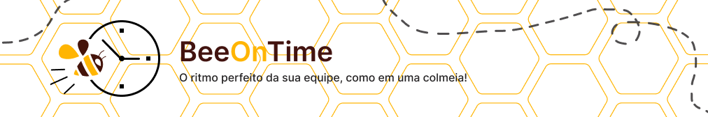
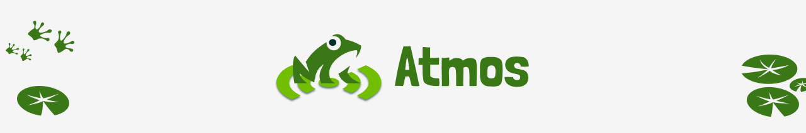

# Portfólio - Karen Gonçalves

<h2>Sumário</h2>

🔹 <a href="#sobre-mim">Sobre mim</a>

🔹 <a href="#meus-projetos">Meus Projetos</a>

<ul>
  <li><a href="#smart-farm">1º SEM: SmartFarm</a></li>
  <li><a href="#cloud-stock">2º SEM: CloudStock</a></li>
  <li><a href="#beeontime">3º SEM: BeeOnTime</a></li>
  <li><a href="#atmos">4º SEM: Atmos</a></li>
  <li><a href="#veredito">5º SEM: Veredito</a></li>
</ul>

---

<h2 id="sobre-mim">Sobre Mim</h2>

<table align="center">
  <tr>
    <td align="center">
      <a href="https://www.linkedin.com/in/karen-cgoncalves/">
         
        <b>Karen Gonçalves</b>
      </a> 
      <b>Desenvolvedora de Software</b>
    </td>
  </tr>
</table>

Atualmente estou cursando o 4º semestre de Desenvolvimento de Software Multiplataforma oferecido pela Faculdade de Tecnologia de São José dos Campos (FATEC). Além disso, sou técnica em Desenvolvimento de Sistemas pela ETEC Profª Ilza Nascimento Pintus.

Atuo como desenvolvedora de software na Autaza, uma empresa especializada em soluções de visão computacional e inteligência artificial aplicadas à indústria. Nessa função, colaboro em projetos que envolvem desde o desenvolvimento de aplicações full-stack até a integração com modelos de IA para inspeção automatizada de qualidade.

Saiba mais sobre mim <a href="https://github.com/karengoncalves8/PortfolioGAP/tree/main/AboutMe/AboutMe.md">aqui!</a>

  
  

---

<h2 id="meus-projetos">Meus Projetos</h2>

<!-- ========== SMART FARM ========== -->

<h3 id="smart-farm">SmartFarm • 1º Semestre • 2024/01</h3>

  <a href="https://github.com/SkyFlyTeam/SmartFarm" target="_blank">Repositório do Projeto</a> • Equipe SkyFly

<b>📑 Descrição do Problema</b>

A equipe I9, do curso de Manufatura Avançada da FATEC, identificou que o processo de coleta e análise de dados ambientais em estufas inteligentes, feito manualmente via Excel, é lento, propenso a erros e exige muito da equipe técnica. Essa limitação dificulta o acompanhamento eficiente do cultivo de plantas e hortaliças, impactando diretamente na produtividade e no controle ambiental.

<b>🎯 Objetivo</b>

Desenvolver um painel de visualização capaz de monitorar em tempo real as condições da estufa por meio de gráficos interativos e automatizar tanto a coleta quanto o armazenamento de dados ambientais. O foco é melhorar a eficiência, reduzir o esforço manual e garantir mais precisão no monitoramento.

<b>💡 Solução</b>

Foi criado um site com interface amigável e intuitiva, que realiza comunicação direta com a placa utilizada, de forma que os dados capturados pela estufa são apresentados de forma visual e clara em tempo real. A plataforma permite acompanhar as variáveis ambientais da estufa por meio de gráficos, facilitando a tomada de decisões.

<b>🛠️ Tecnologias Utilizadas</b>

  
  
  
  
  
  
  

<b>🙋‍♀️ Contribuições Pessoais</b>

Atuei como desenvolvedora da equipe SkyFly, ajudando na elaboração do protótipo inicial da aplicação e sendo responsável pelo desenvolvimento do frontend. Colaborei ativamente com meus colegas de equipe, oferecendo suporte técnico, especialmente nas etapas que envolviam HTML e CSS, visto que muitos estavam tendo o primeiro contato com essas tecnologias. Minha experiência prévia foi fundamental para orientar o time e garantir um desenvolvimento mais fluido e colaborativo. Também desenvolvi algumas funcionalidades no backend, como rotas para retornar os dados a serem exibidos nos gráficos.

<b>Habilidades Adquiridas</b>

  
<b>Hard Skills</b>

  <ul>
    <li>HTML/CSS</li>
    <li>Docker</li>
    <li>MySQL</li>
    <li>Figma</li>
    <li>Git e GitHub</li>
  </ul>

  
<b>Soft Skills</b>

  <ul>
    <li><b>Colaboração em equipe multidisciplinar:</b> Cada membro da equipe tinha conhecimentos e tendia para uma área de desenvolvimento — frontend, backend ou DevOps. Isso exigiu um esforço conjunto para alinhar objetivos e resolver problemas técnicos sem que cada um ficasse restrito ao seu núcleo, mas fosse capaz de aprender e contribuir em outras áreas. Pessoalmente, foi meu primeiro contato com DevOps.</li>
    <li><b>Comunicação clara e didática com colegas:</b> Durante o desenvolvimento da API, precisei documentar e explicar conceitos e ferramentas de forma acessível para membros com diferentes níveis de conhecimento, incluindo decisões sobre o Figma — uma ferramenta com a qual muitos nunca haviam trabalhado.</li>
    <li><b>Proatividade na resolução de problemas e estudo de tecnologias:</b> Identifiquei a necessidade de utilizar a biblioteca Pandas para geração de gráficos e análise de dados, dado o conjunto de funcionalidades já integradas que seriam úteis para o cliente. Fui proativa em aprender e aplicar esse conhecimento para gerar relatórios visuais que facilitassem a interpretação dos dados.</li>
    <li><b>Organização e gestão de tempo:</b> Para garantir entregas dentro do prazo, organizei meu tempo de forma eficiente, priorizando tarefas conforme a urgência. Isso foi essencial no processo de desenvolvimento da API, onde a gestão do tempo foi fundamental para integrar várias funcionalidades de forma coesa sem comprometer a qualidade do código.</li>
    <li><b>Adaptabilidade a diferentes níveis de conhecimento técnico:</b> Com membros de experiências variadas, adaptar minha comunicação e abordagem de trabalho foi fundamental para garantir que todos pudessem contribuir efetivamente, mesmo aqueles com menos familiaridade com determinadas tecnologias.</li>
    <li><b>Empatia e apoio ao aprendizado dos colegas:</b> Sempre que um membro encontrava dificuldades técnicas, oferecia apoio — seja auxiliando diretamente na tarefa ou indicando recursos educativos relevantes.</li>
  </ul>

<b>📚 Lições Aprendidas</b>

Durante o desenvolvimento do projeto SmartFarm, aprofundei meus conhecimentos no desenvolvimento de APIs com Python, utilizando o framework Flask. Trabalhei com a manipulação de grandes volumes de dados, focando na sua organização e exibição acessível por meio de gráficos construídos com Pandas, uma biblioteca amplamente utilizada no mercado. Além dos aprendizados técnicos, também evoluí significativamente na comunicação e colaboração em equipe, contribuindo ativamente com o compartilhamento de conhecimentos e apoiando meus colegas ao longo do projeto.

---

<!-- ========== CLOUD STOCK ========== -->

<h3 id="cloud-stock">CloudStock • 2º Semestre • 2024/02</h3>

  <a href="https://github.com/SkyFlyTeam/cloudStock" target="_blank">Repositório do Projeto</a> • Equipe SkyFly

<b>📑 Descrição do Problema</b>

A problemática foi apresentada por um cliente interno da FATEC, que relatou dificuldades no gerenciamento de estoque devido a processos manuais e descentralizados. Esses métodos estavam sujeitos a falhas humanas, falta de rastreabilidade e ausência de relatórios em tempo real, comprometendo a eficiência operacional e a tomada de decisões estratégicas.

<b>🎯 Objetivo</b>

Desenvolver um sistema de controle de estoque capaz de organizar, automatizar e facilitar a gestão de produtos, fornecedores e movimentações de estoque. O objetivo foi garantir maior controle sobre o inventário, reduzir erros e permitir uma visualização clara de entradas, saídas e níveis de estoque.

<b>💡 Solução</b>

Foi desenvolvido um website completo e intuitivo, com funcionalidades como cadastro de itens e fornecedores, controle de entradas e saídas, geração de relatórios e alertas automáticos. A plataforma oferece uma experiência prática e organizada, promovendo maior controle logístico e agilidade na gestão de estoque.

<b>🛠️ Tecnologias Utilizadas</b>

  
  
  
  
  
  
  

<b>🙋‍♀️ Contribuições Pessoais</b>

Atuei como desenvolvedora da equipe SkyFly, ajudando na elaboração do protótipo inicial da aplicação e sendo responsável pelo desenvolvimento tanto do frontend quanto do backend. Participei ativamente da modelagem do banco de dados e das discussões sobre os requisitos apresentados. Desenvolvi funcionalidades-chave, como o sistema de notificações utilizando triggers e WebSocket.

<b>Habilidades Adquiridas</b>

  
<b>Hard Skills</b>

  <ul>
    <li>React</li>
    <li>Node.js</li>
    <li>TypeScript</li>
    <li>Docker</li>
    <li>MySQL</li>
    <li>Figma</li>
    <li>Git e GitHub</li>
  </ul>

  
<b>Soft Skills</b>

  <ul>
    <li><b>Elaboração de VPC e DoR/DoD:</b> Utilizamos o VPC para compreender melhor as expectativas do cliente, e o DoR e DoD para estabelecer padrões claros de início e conclusão das entregas em cada sprint. Essas definições garantiram que as funcionalidades estivessem bem preparadas antes de serem iniciadas e que atendessem aos critérios de qualidade ao final. Foi meu primeiro contato com esses artefatos, e o impacto positivo no processo de desenvolvimento foi imediato.</li>
    <li><b>Colaboração no compartilhamento de conhecimento:</b> Como Node.js e React eram novidades para a equipe, aprendemos e compartilhamos conhecimentos juntos. Realizamos sessões de estudo em grupo nas quais cada membro contribuiu com suas descobertas, o que garantiu uma integração eficiente das tecnologias e acelerou a curva de aprendizado coletiva.</li>
    <li><b>Comunicação transparente e frequente por meio de dailies:</b> A comunicação constante foi fundamental para o andamento do projeto. Durante as reuniões diárias, discutíamos o progresso das tarefas, identificávamos bloqueios e compartilhávamos atualizações importantes, mantendo todos alinhados e comprometidos com os objetivos.</li>
    <li><b>Proatividade na resolução de problemas:</b> Identifiquei que alguns componentes, como os modais, não estavam funcionando corretamente para todas as funcionalidades por falta de generalização no código. Tomei a iniciativa de refatorá-los, tornando-os mais flexíveis e reutilizáveis, o que eliminou bugs e melhorou a qualidade geral do sistema.</li>
    <li><b>Organização e gestão de tempo:</b> Com a carga crescente das disciplinas da faculdade, aprimorei minha organização utilizando ferramentas como Kanban e Notion para planejar tarefas com antecedência e garantir as entregas dentro do prazo sem prejudicar o desempenho em outras áreas.</li>
    <li><b>Adaptabilidade a demandas urgentes para entrega no prazo:</b> Diante de imprevistos que afetaram o andamento do projeto, alguns membros da equipe — eu inclusa — precisaram se adaptar rapidamente, ajustando prioridades e intensificando o esforço para garantir a entrega completa. A flexibilidade e o empenho coletivo foram essenciais para o cumprimento dos prazos.</li>
  </ul>

<b>📚 Lições Aprendidas</b>

Durante o desenvolvimento do projeto CloudStock, aprofundei meus conhecimentos na criação de interfaces com React, utilizando componentes e estados de forma organizada e eficiente. Com o aumento do volume de dados manipulados, a performance do website tornou-se uma preocupação central, o que me levou a adotar práticas voltadas à otimização e ao desempenho. Neste semestre, trabalhamos com uma documentação mais detalhada, incorporando critérios como DoR e DoD, o que exigiu maior organização, planejamento e alinhamento entre os membros da equipe. Além disso, obtive experiência prática com Node.js e Express no backend, contribuindo com a criação de modelos e o desenvolvimento de funcionalidades essenciais do sistema.

---

<!-- ========== BEEONTIME ========== -->

<h3 id="beeontime">BeeOnTime • 3º Semestre • 2025/01</h3>

  <a href="https://github.com/SkyFlyTeam/beeOnTime-documentation" target="_blank">Repositório do Projeto</a> • Equipe SkyFly

<b>📑 Descrição do Problema</b>

A problemática foi apresentada pela empresa Necto Systems, que realizava o controle de ponto dos colaboradores por meio de planilhas Excel. Esse método manual dificultava o acompanhamento preciso das horas trabalhadas, gerava riscos de inconsistência nos dados e não oferecia visibilidade eficiente para a gestão de jornadas, folgas, férias e horas extras.

<b>🎯 Objetivo</b>

Desenvolver uma aplicação web moderna e responsiva que automatize o controle de ponto eletrônico dos colaboradores. O objetivo foi garantir maior confiabilidade no registro de jornada, facilitar o gerenciamento de horas extras, folgas e férias, além de disponibilizar relatórios detalhados para a tomada de decisões da empresa.

<b>💡 Solução</b>

Foi criada a plataforma BeeOnTime, um website intuitivo que permite o registro de ponto eletrônico, visualização do espelho de ponto, controle de banco de horas e envio de justificativas e notificações. A aplicação oferece ferramentas completas para colaboradores, gestores e administradores, promovendo organização, transparência e eficiência no acompanhamento da jornada de trabalho.

<b>🛠️ Tecnologias Utilizadas</b>

  
  
  
  
  
  
  
  
  
  

<b>🙋‍♀️ Contribuições Pessoais</b>

Atuei como desenvolvedora da equipe SkyFly, contribuindo desde a elaboração do protótipo inicial até a implementação final da aplicação. Fui responsável pela modelagem do banco de dados, definição da arquitetura dos microsserviços e desenvolvimento tanto do frontend quanto do backend. Desenvolvi uma das funcionalidades centrais do sistema — a marcação de ponto eletrônico — incluindo o cálculo e armazenamento das horas trabalhadas por cada colaborador. Também assumi a responsabilidade pela gestão do banco de dados no MongoDB, garantindo consistência e desempenho na manipulação das informações.

<b>Habilidades Adquiridas</b>

  
<b>Hard Skills</b>

  <ul>
    <li>React</li>
    <li>Node.js</li>
    <li>TypeScript</li>
    <li>Spring Boot</li>
    <li>Microsserviços</li>
    <li>MongoDB</li>
    <li>Docker</li>
    <li>Figma</li>
    <li>Git e GitHub</li>
  </ul>

  
<b>Soft Skills</b>

  <ul>
    <li><b>Colaboração no compartilhamento de conhecimento:</b> A equipe estava começando a trabalhar com Java/Spring no backend e com o conceito de microsserviços, o que representava um desafio novo para todos. Para superar isso, adotamos uma abordagem colaborativa, aprendendo e compartilhando conhecimentos de forma contínua. Fiz questão de compartilhar todas as minhas descobertas sobre as tecnologias usadas, o que facilitou a integração e acelerou o processo de aprendizado coletivo.</li>
    <li><b>Comunicação clara e constante por meio de reuniões diárias e planejamento de sprints:</b> A comunicação foi mantida de forma clara e frequente por meio de dailies, onde discutíamos os avanços e obstáculos das tarefas. Participei ativamente nas revisões e planejamentos das sprints, contribuindo para que todos os membros estivessem alinhados quanto aos objetivos e prazos, o que facilitou a adaptação de prioridades conforme necessário.</li>
    <li><b>Proatividade na identificação e resolução de problemas:</b> Durante o desenvolvimento, identifiquei uma oportunidade de melhorar o fluxo de trabalho no controle de código e propus um novo formato de Merge Requests. Essa proposta visava aumentar a qualidade e eficiência nas entregas por meio de uma revisão mais detalhada e criteriosa, resultando em um código mais limpo. Foi prontamente aceita pela equipe e gerou impacto positivo nas entregas.</li>
    <li><b>Organização e gestão eficiente do tempo e das tarefas:</b> Para garantir que o desenvolvimento seguisse dentro do cronograma, utilizei ferramentas de gestão como o Kanban para priorizar atividades e manter o controle das entregas, dividindo as tarefas em blocos menores e assegurando que os prazos fossem cumpridos sem comprometer a qualidade.</li>
    <li><b>Adaptabilidade para lidar com mudanças propostas pelo cliente:</b> Durante o projeto, o cliente realizou alterações significativas nos requisitos. Me adaptei rapidamente, realizando ajustes nas funcionalidades de forma eficiente e alinhada ao planejamento da equipe, mantendo sempre o foco nas entregas de valor.</li>
    <li><b>Comprometimento com a entrega de resultados dentro do prazo:</b> Comprometi-me integralmente com os prazos estipulados, garantindo que todas as tarefas fossem entregues conforme o planejado. Mesmo diante de dependências externas, fiz o que pude para deixar tudo pronto e apoiei meus colegas para que a entrega final fosse possível.</li>
  </ul>

<b>📚 Lições Aprendidas</b>

Durante o desenvolvimento do projeto BeeOnTime, adquiri conhecimentos em arquitetura de microsserviços e no desenvolvimento em Java, a nova tecnologia explorada nesse semestre. Trabalhar com banco de dados NoSQL (MongoDB) me proporcionou uma nova perspectiva sobre modelagem de dados voltada para flexibilidade e desempenho, assim como a manipulação desses dados dentro de uma arquitetura estruturada. Obtive também maior experiência na modelagem de banco de dados para sistemas complexos como o apresentado nessa problemática.

---

<!-- ========== ATMOS ========== -->

<h3 id="atmos">Atmos • 4º Semestre • 2025/02</h3>

  <a href="https://github.com/SkyFlyTeam/Atmos-documentation" target="_blank">Repositório do Projeto</a> • Equipe SkyFly

<b>📑 Descrição do Problema</b>

A Tecsus, empresa especializada em Internet das Coisas (IoT), tem se mostrado cada vez mais preocupada com o aumento dos desastres meteorológicos nos últimos anos. Muitos desses eventos poderiam ao menos ter sido mitigados caso a população tivesse acesso a alertas antecipados. Com o objetivo de oferecer uma solução eficaz, a empresa se dedica ao desenvolvimento de estações meteorológicas que fornecem uma visão precisa e em tempo real das condições climáticas a um custo acessível. No entanto, havia a necessidade de criar uma forma simples e centralizada para visualizar e gerenciar todos esses dados de maneira eficiente.

<b>🎯 Objetivo</b>

Desenvolver uma solução capaz de monitorar o clima e as condições do solo, enviar alertas em situações de risco e oferecer uma área educacional para conscientizar a população sobre os riscos e como se proteger.

<b>💡 Solução</b>

Foi criado um site responsivo e intuitivo que recebe e exibe dados em tempo real das estações meteorológicas, em parceria com a Tecsus. A plataforma inclui páginas de administração para gerenciar estações, parâmetros e alertas, além de funcionalidades de visualização por meio de gráficos e relatórios mensais, proporcionando uma visão clara e acessível das condições climáticas e riscos associados.

<b>🛠️ Tecnologias Utilizadas</b>

  
  
  
  
  
  
  
  

<b>🙋‍♀️ Contribuições Pessoais</b>

Atuei como desenvolvedora na equipe SkyFly, participando desde a concepção do protótipo inicial até a entrega da versão final da aplicação. Colaborei no desenvolvimento de funcionalidades essenciais, como a geração de alertas com base nos valores capturados e a criação do dashboard. Além disso, fui responsável pela implementação de testes de integração, assegurando que o sistema operasse conforme o esperado.

<b>Habilidades Adquiridas</b>

  
<b>Hard Skills</b>

  <ul>
    <li>React</li>
    <li>Node.js</li>
    <li>TypeScript</li>
    <li>Arduino com C++</li>
    <li>Programação com IoT</li>
    <li>Estados de Máquina</li>
    <li>MongoDB</li>
    <li>Docker</li>
    <li>Figma</li>
    <li>Git e GitHub</li>
  </ul>

  
<b>Soft Skills</b>

  <ul>
    <li><b>Colaboração no compartilhamento de conhecimento:</b> Propus a implementação de uma nova estrutura para o projeto, com o objetivo de otimizar nossa organização interna. Para garantir que todos compreendessem a mudança, tomei a iniciativa de explicar detalhadamente o novo processo para meus colegas, de forma que a transição fosse suave e a alteração trouxesse benefícios reais para a equipe como um todo.</li>
    <li><b>Comunicação constante e eficiente por meio de reuniões diárias e planejamento de sprints:</b> Mantivemos uma comunicação fluida por meio de dailies, nas quais compartilhávamos atualizações sobre as tarefas em andamento e discutíamos dificuldades e obstáculos. Estive ativamente envolvida nas reuniões de revisão e planejamento das sprints, colaborando para assegurar que todos os membros estivessem alinhados com as prioridades e os prazos.</li>
    <li><b>Proatividade na execução de tarefas adicionais:</b> Após concluir minhas tarefas iniciais, busquei contribuir ainda mais com o time. Apoiei colegas a superar obstáculos e assumi responsabilidades extras quando identifiquei tarefas com prazos apertados. Essa postura proativa ajudou a manter o fluxo de trabalho contínuo e a minimizar riscos no cronograma.</li>
    <li><b>Comprometimento com a entrega pontual dos resultados:</b> Mantive um alto nível de comprometimento com os prazos acordados, garantindo que todas as tarefas fossem entregues conforme o planejado, dentro dos padrões de qualidade exigidos.</li>
  </ul>

<b>📚 Lições Aprendidas</b>

Este projeto me proporcionou valiosas lições, principalmente sobre a importância de ter um processo bem estruturado e seguido rigorosamente pela equipe. Com um fluxo de trabalho claro, conseguimos garantir entregas constantes e confiáveis. Além disso, foi minha primeira experiência com desenvolvimento de IoT, o que se mostrou desafiador, mas extremamente enriquecedor. A integração de dispositivos e sistemas para coletar e analisar dados em tempo real exigiu aprendizado contínuo e me proporcionou uma nova perspectiva sobre inovação tecnológica e a aplicação prática da Internet das Coisas.

---

<!-- ========== VEREDITO ========== -->

<h3 id="veredito">Veredito • 5º Semestre • 2026/01</h3>

  <a href="https://github.com/SkyFlyTeam/veredito-documentation" target="_blank">Repositório do Projeto</a> • Equipe SkyFly

<b>📑 Descrição do Problema</b>

Nos últimos anos, o volume de processos judiciais e a complexidade das teses apresentadas cresceram de forma significativa, tornando mais difícil para juízes e assessores localizar rapidamente precedentes adequados e fundamentar decisões com agilidade e segurança. Esse cenário impacta diretamente a eficiência do Judiciário, prolongando a tramitação dos processos e aumentando o risco de decisões pouco alinhadas à jurisprudência consolidada.

<b>🎯 Objetivo</b>

Desenvolver um aplicativo voltado para magistrados e suas equipes que automatize a análise de petições iniciais e a sugestão de precedentes jurídicos relevantes. O objetivo foi oferecer uma ferramenta que agilize a fundamentação das decisões judiciais, tornando o processo mais célere, seguro e alinhado à jurisprudência consolidada.

<b>💡 Solução</b>

Foi criada a plataforma Veredito, um aplicativo que recebe a petição inicial (em formatos PDF, DOCX ou TXT), realiza a leitura e análise automática do conteúdo e gera um resumo da peça. A partir dessa análise, o sistema identifica e apresenta os precedentes mais relevantes ranqueados por grau de similaridade e classificados quanto à sua aplicabilidade (Aplicável, Possivelmente aplicável ou Não aplicável), com sínteses explicativas da relação entre cada precedente e a petição enviada. Além disso, a plataforma permite a geração de minutas de sentenças e petições iniciais, histórico de análises e exportação de documentos.

<b>🛠️ Tecnologias Utilizadas</b>

  
  
  
  
  
  
  
  
  

<b>🙋‍♀️ Contribuições Pessoais</b>

Neste projeto, atuei como Product Owner pela primeira vez, assumindo a responsabilidade de conversar diretamente com o cliente, levantar e documentar os requisitos do sistema e garantir que as dores do cliente fossem atendidas ao longo de todo o desenvolvimento. Elaborei o wireframe completo da aplicação e sua identidade visual, incluindo uma logo original e alinhada ao tema do projeto. Além disso, apresentei ao time o padrão Clean Architecture para ser adotado no desenvolvimento do frontend.

<b>Habilidades Adquiridas</b>

  
<b>Hard Skills</b>

  <ul>
    <li>Flutter</li>
    <li>Dart</li>
    <li>Node.js</li>
    <li>NestJS</li>
    <li>PostgreSQL</li>
    <li>Docker</li>
    <li>Figma</li>
    <li>Git e GitHub</li>
  </ul>

  
<b>Soft Skills</b>

  <ul>
    <li><b>Comunicação interna com o time:</b> Mantive contato contínuo com os desenvolvedores ao longo de todo o projeto, garantindo que todos tivessem clareza sobre o que precisava ser desenvolvido, o contexto por trás de cada decisão e a motivação dos requisitos — o que reduziu retrabalho e manteve o time alinhado.</li>
    <li><b>Comunicação com o cliente:</b> Desenvolvi a habilidade de atuar como ponte entre o time técnico e o cliente, traduzindo dúvidas complexas de forma objetiva e organizada. Isso evitou o desgaste de perguntas fragmentadas e tornou as interações com o cliente mais produtivas e assertivas.</li>
    <li><b>Proatividade na adoção de novas tecnologias:</b> Pesquisei e apresentei ao time novas metodologias, ferramentas e abordagens técnicas que pudessem otimizar tanto o processo de desenvolvimento quanto a qualidade da aplicação, estimulando uma cultura de melhoria contínua dentro da equipe.</li>
  </ul>

<b>📚 Lições Aprendidas</b>

Durante o desenvolvimento do Veredito, uma das principais lições foi a importância da otimização — tanto de custos quanto de desempenho — ao trabalhar com LLMs. A dependência de modelos de linguagem exigiu atenção cuidadosa ao consumo de tokens, ao tempo de resposta e à eficiência das chamadas à API, especialmente considerando o perfil exigente do público-alvo da aplicação. Além disso, a necessidade de adaptar rapidamente o sistema a novos requisitos reforçou na prática o valor de uma arquitetura escalável e bem estruturada: decisões de design tomadas com cuidado no início do projeto se mostraram fundamentais para absorver mudanças sem comprometer a estabilidade ou gerar dívida técnica acumulada.

